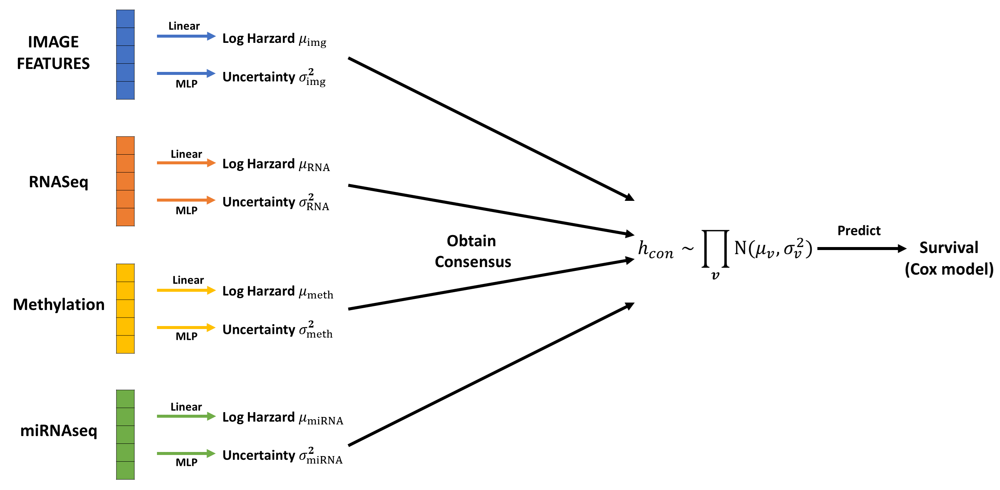

# VCSM
This repository contains the code for Variational Consensus SurvivalModel (VCSM). VCSM overcomes two major limitations of current
methods: 1) while traditional multi-view methods excel at identifying shared information across different data views, they often neglect the rich complementary information contained in the diverse data; and 2) existing approaches struggle to handle missing data views effectively,
a common issue in this research area. VCSM treats the hazard prediction from each data view (i.e., each type of data) as a variational Gaussian distribution. Specifically, the mean parameter of this distribution that models the hazard predicted with each view is estimated with a linear model, while the uncertainty in these hazard predictions is modelled through the variance parameter, which is determined using a multi-layer perceptron (MLP). The consensus across various views is given by multiplying the variational Gaussian distributions.

## Installation

To use this project, follow these steps:

### 1. Clone the repository:

git clone https://github.com/Chen-Jxiang/VCSM.git

cd VCSM

### 2. Create a virtual environment (optional but recommended):
python -m venv venv

source venv/bin/activate  # On Windows, use venv\Scripts\activate

### 3. Install PyTorch with CUDA support:
pip3 install torch torchvision torchaudio --index-url https://download.pytorch.org/whl/cu124

### 4. Install all dependencies by running:
pip install -r requirements.txt
